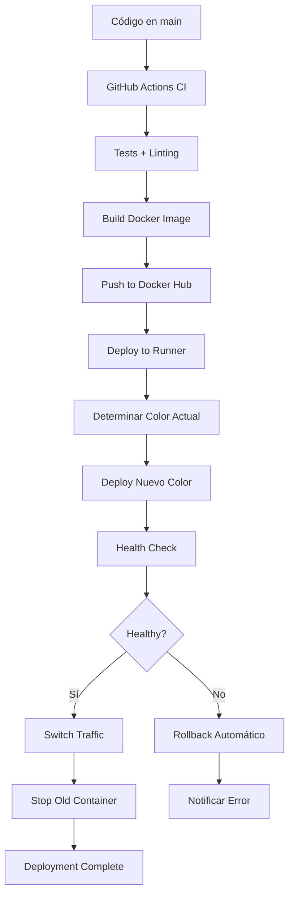

# 🚀 Production Deployment Guide - Docker + GitHub Actions

Este documento explica cómo implementar el sistema de deployment de producción usando Docker puro (sin docker-compose) y GitHub Actions con estrategia Blue/Green.

## 📦 Componentes del Sistema

### 1. **Volúmenes Docker para Persistencia**
```bash
# Datos de PostgreSQL (CRÍTICO - Nunca eliminar en producción)
tecnologiaplus-postgres-data

# Datos de desarrollo (Para entorno local)
tecnologiaplus-postgres-dev-data
```

### 2. **Contenedores**
```bash
# Base de datos
tecnologiaplus-postgres        # Producción
tecnologiaplus-postgres-dev    # Desarrollo

# Backend (Blue/Green)
tecnologiaplus-backend-blue    # Puerto 3001
tecnologiaplus-backend-green   # Puerto 3002
tecnologiaplus-backend-dev     # Desarrollo (3001)
```

## 🔄 Estrategia Blue/Green Deployment

### ¿Qué es Blue/Green?
El deployment Blue/Green mantiene dos versiones idénticas del servicio:
- **Blue**: Versión actualmente sirviendo tráfico
- **Green**: Nueva versión que se despliega y prueba

### Flujo de Deployment



## 🛠️ Scripts de Deployment

### 1. **scripts/deploy-production.sh**
**Uso en CI/CD**: Deployment automático con GitHub Actions
```bash
# Deployment automático (GitHub Actions)
./scripts/deploy-production.sh "myregistry/backend:v1.2.3"

# Variables requeridas (en GitHub Secrets):
# DB_USERNAME, DB_PASSWORD, DB_NAME
# JWT_SECRET
# CLOUDINARY_CLOUD_NAME, CLOUDINARY_API_KEY, CLOUDINARY_API_SECRET
```

**Características:**
- ✅ Blue/Green deployment automático
- ✅ Health checks integrados
- ✅ Migraciones automáticas
- ✅ Rollback en caso de fallo
- ✅ Cleanup de imágenes antiguas

### 2. **scripts/deploy-dev.sh**
**Uso local**: Desarrollo con hot reload
```bash
# Deploy completo de desarrollo
./scripts/deploy-dev.sh

# Solo ver logs
./scripts/deploy-dev.sh logs

# Solo migraciones
./scripts/deploy-dev.sh migrate

# Limpiar todo
./scripts/deploy-dev.sh clean
```

### 3. **scripts/rollback.sh**
**Uso en emergencias**: Rollback rápido
```bash
# Rollback automático al contenedor anterior
./scripts/rollback.sh

# Ver estado actual
./scripts/rollback.sh status

# Confirmar rollback (parar contenedor problemático)
./scripts/rollback.sh confirm

# Rollback a versión específica
./scripts/rollback.sh rollback-to-image "myregistry/backend:v1.0.0"
```

## 🧪 Testing de Producción Local

### Docker Compose para Testing de Builds de Producción

Para validar que tu build de producción funciona correctamente antes del deployment, usa el ambiente de testing específico.

#### Archivo: `docker-compose.prod-test.yml`

Este archivo permite probar la imagen de producción localmente con:
- **Build target**: `production` (imagen optimizada)
- **Puertos separados**: Para no conflictar con desarrollo
- **Base de datos aislada**: Datos independientes
- **Health checks**: Verificaciones automáticas
- **Migraciones automáticas**: Se ejecutan al iniciar el contenedor

### 🔄 Migraciones Automáticas

**¡NUEVO!** Las migraciones ahora se ejecutan automáticamente en todos los entornos:

#### Secuencia de Inicio (Automática)
```bash
🔗 Waiting for PostgreSQL...
✅ PostgreSQL is ready!
🔄 Running migrations...
🌱 Running seeds...
🚀 Starting production application...
```

#### Entornos con Migraciones Automáticas
- ✅ **Development**: `make dev` → migraciones automáticas
- ✅ **Prod Test**: `make prod-test` → migraciones automáticas  
- ✅ **Producción**: deployment script → migraciones automáticas

#### Ventajas
- 🚀 No hay pasos manuales olvidados
- 🔄 Siempre actualizado con la última estructura de BD
- 🛡️ Consistencia entre todos los entornos
- ⚡ Deploy más rápido y confiable

### Comandos de Testing de Producción

#### Con Make (Recomendado)
```bash
# Iniciar test completo de producción
make prod-test

# Ver logs en tiempo real
make prod-test-logs

# Las migraciones se ejecutan automáticamente al iniciar
# make prod-test-migrate (ya no es necesario)

# Parar servicios de test
make prod-test-stop

# Limpiar completamente (incluyendo volúmenes)
make prod-test-clean
```

#### Comandos Docker Compose Directos
```bash
# Iniciar servicios con build automático
docker-compose -f docker-compose.prod-test.yml up --build -d

# Ver logs del backend
docker-compose -f docker-compose.prod-test.yml logs -f backend

# Ver estado de todos los servicios
docker-compose -f docker-compose.prod-test.yml ps

# Ejecutar migraciones (usando profiles)
docker-compose -f docker-compose.prod-test.yml --profile migration up migration

# Rebuild sin cache
docker-compose -f docker-compose.prod-test.yml build --no-cache

# Solo iniciar base de datos
docker-compose -f docker-compose.prod-test.yml up postgres -d

# Parar servicios
docker-compose -f docker-compose.prod-test.yml down

# Limpiar volúmenes y redes
docker-compose -f docker-compose.prod-test.yml down -v

# Usar archivo .env específico
docker-compose -f docker-compose.prod-test.yml --env-file .env.prod-test up -d
```

### URLs de Acceso en Testing

- **Backend API**: http://localhost:3002
- **Swagger Documentation**: http://localhost:3002/api
- **Health Check**: http://localhost:3002/health
- **PostgreSQL**: localhost:5433

### Puertos y Configuración

| Servicio | Desarrollo | Production Test | Producción |
|----------|------------|-----------------|------------|
| **Backend** | 3001 | 3002 | 3001 |
| **PostgreSQL** | 5432 | 5433 | 5432 |
| **Docker Target** | development | production | production |
| **Hot Reload** | ✅ Sí | ❌ No | ❌ No |
| **Optimización** | ❌ No | ✅ Sí | ✅ Sí |

### Flujo de Testing Típico

```bash
# 1. Iniciar ambiente de testing
make prod-test

# 2. Verificar que el servicio está funcionando
curl -f http://localhost:3002/health

# 3. Probar API
curl http://localhost:3002/api

# 4. Ver logs si hay problemas
make prod-test-logs

# 5. Ejecutar migraciones si es necesario
make prod-test-migrate

# 6. Validar funcionalidades críticas
# - Login/Authentication
# - CRUD operations
# - File uploads (Cloudinary)
# - Email sending

# 7. Limpiar cuando termines
make prod-test-clean
```

### Debugging en Testing de Producción

```bash
# Entrar al contenedor para debugging
docker exec -it tecnologiaplus-backend-prod-test sh

# Ver logs específicos
docker logs tecnologiaplus-backend-prod-test

# Verificar variables de entorno
docker exec tecnologiaplus-backend-prod-test env

# Verificar conectividad a base de datos
docker exec tecnologiaplus-postgres-prod-test pg_isready -U postgres

# Verificar procesos dentro del contenedor
docker exec tecnologiaplus-backend-prod-test ps aux

# Verificar espacio en disco del contenedor
docker exec tecnologiaplus-backend-prod-test df -h
```

### Diferencias vs Desarrollo

#### Desarrollo (`docker-compose.yml`)
- **Propósito**: Coding y debugging
- **Hot reload**: Cambios en código reflejados automáticamente
- **Volúmenes**: Código fuente montado
- **Performance**: No optimizada
- **Tamaño imagen**: Grande (incluye dev dependencies)

#### Testing de Producción (`docker-compose.prod-test.yml`)
- **Propósito**: Validar build de producción
- **Hot reload**: No disponible
- **Volúmenes**: Solo datos persistentes
- **Performance**: Optimizada
- **Tamaño imagen**: Pequeña (solo production dependencies)

### Casos de Uso para Testing de Producción

1. **Antes de hacer merge a main**: Validar que el build funciona
2. **Testing de performance**: Verificar optimizaciones
3. **Validación de configuración**: Probar variables de entorno
4. **Testing de migraciones**: Validar cambios de BD en ambiente similar a producción
5. **QA final**: Testing completo antes de deployment

## 🔧 Configuración GitHub Actions

### Secrets Requeridos

```env
# Docker Hub
DOCKER_HUB_USERNAME=tu-usuario
DOCKER_HUB_ACCESS_TOKEN=tu-token

# Base de Datos
DB_USERNAME=postgres
DB_PASSWORD=tu-password-seguro
DB_NAME=blog_db

# Aplicación
JWT_SECRET=tu-jwt-secret-muy-largo-y-seguro

# Cloudinary
CLOUDINARY_CLOUD_NAME=tu-cloud-name
CLOUDINARY_API_KEY=tu-api-key
CLOUDINARY_API_SECRET=tu-api-secret

# Email (opcional)
MAIL_HOST=smtp.gmail.com
MAIL_PORT=587
MAIL_USER=tu-email@gmail.com
MAIL_PASS=tu-app-password
MAIL_FROM=noreply@tudominio.com

# Frontend
FRONTEND_URL=https://tudominio.com

# SSH para Self-hosted Runner
SSH_USER_PASSWORD=password-del-runner
```

### Environments GitHub

1. **production** (branch: main)
2. **staging** (branch: staging)  
3. **development** (branch: develop)

## 🖥️ Self-hosted Runner Setup

### Requisitos del Servidor
```bash
# Mínimo recomendado
CPU: 2 cores
RAM: 4GB
Disk: 50GB SSD
OS: Ubuntu 22.04 LTS

# Docker instalado
sudo apt update
sudo apt install docker.io docker-compose-v2
sudo usermod -aG docker $USER
```

### Configuración del Runner
```bash
# Descargar GitHub Runner
mkdir actions-runner && cd actions-runner
curl -o actions-runner-linux-x64-2.311.0.tar.gz -L https://github.com/actions/runner/releases/download/v2.311.0/actions-runner-linux-x64-2.311.0.tar.gz
tar xzf ./actions-runner-linux-x64-2.311.0.tar.gz

# Configurar (usar token de GitHub)
./config.sh --url https://github.com/tu-usuario/tu-repo --token TU_TOKEN

# Ejecutar como servicio
sudo ./svc.sh install
sudo ./svc.sh start
```

## 🌐 Load Balancer / Reverse Proxy

### Nginx Configuration
```nginx
upstream backend_servers {
    server localhost:3001 weight=1 max_fails=3 fail_timeout=30s;
    server localhost:3002 weight=1 max_fails=3 fail_timeout=30s backup;
}

server {
    listen 80;
    server_name api.tudominio.com;

    location / {
        proxy_pass http://backend_servers;
        proxy_set_header Host $host;
        proxy_set_header X-Real-IP $remote_addr;
        proxy_set_header X-Forwarded-For $proxy_add_x_forwarded_for;
        proxy_set_header X-Forwarded-Proto $scheme;
        
        # Health check
        proxy_connect_timeout 5s;
        proxy_send_timeout 5s;
        proxy_read_timeout 30s;
    }
    
    location /health {
        access_log off;
        proxy_pass http://backend_servers/health;
    }
}
```

### HAProxy Configuration (Alternativa)
```haproxy
backend backend_servers
    balance roundrobin
    option httpchk GET /health
    server backend_blue localhost:3001 check
    server backend_green localhost:3002 check backup
```

## 📊 Monitoreo y Observabilidad

### Health Checks
```bash
# Verificar estado de contenedores
docker ps --filter "name=tecnologiaplus"

# Verificar health endpoint
curl -f http://localhost:3001/health
curl -f http://localhost:3002/health

# Ver logs en tiempo real
docker logs -f tecnologiaplus-backend-blue
```

### Métricas de Sistema
```bash
# Uso de recursos
docker stats

# Espacio en disco
df -h
docker system df

# Estado de volúmenes
docker volume ls
docker volume inspect tecnologiaplus-postgres-data
```

## 🚨 Procedimientos de Emergencia

### 1. **Rollback Inmediato**
```bash
# En caso de emergencia
ssh usuario@servidor
cd /path/to/repo
./scripts/rollback.sh

# Verificar que funciona
curl -f http://localhost:3001/health

# Confirmar rollback
./scripts/rollback.sh confirm
```

### 2. **Restaurar Base de Datos**
```bash
# Backup
docker exec tecnologiaplus-postgres pg_dump -U postgres blog_db > backup_$(date +%Y%m%d_%H%M%S).sql

# Restaurar
docker exec -i tecnologiaplus-postgres psql -U postgres blog_db < backup_20241201_143000.sql
```

### 3. **Recrear Contenedores**
```bash
# Parar todo
docker stop tecnologiaplus-backend-blue tecnologiaplus-backend-green

# Recrear con última imagen buena conocida
./scripts/deploy-production.sh "myregistry/backend:last-known-good"
```

## 🔐 Seguridad

### Secretos y Variables
- ✅ **NUNCA** commitear secretos en el código
- ✅ Usar GitHub Secrets para CI/CD
- ✅ Rotar secretos regularmente (JWT_SECRET, API keys)
- ✅ Usar variables de entorno separadas por ambiente

### Network Security
```bash
# Crear red aislada
docker network create --driver bridge --subnet=172.20.0.0/16 tecnologiaplus-network

# Contenedores solo se comunican dentro de la red
# Puerto expuesto solo al load balancer
```

### Acceso SSH
```bash
# Usar keys SSH, no passwords
ssh-keygen -t rsa -b 4096 -C "deploy@tecnologiaplus.com"

# Configurar en servidor
echo "ssh-rsa AAAAB..." >> ~/.ssh/authorized_keys
chmod 600 ~/.ssh/authorized_keys
```

## 📈 Optimizaciones

### Docker Build
```dockerfile
# Multi-stage builds para imágenes más pequeñas
# Cache layers para builds más rápidos
# .dockerignore para contexto mínimo
```

### GitHub Actions
```yaml
# Cache de Docker layers
# Parallel jobs cuando sea posible
# Conditional deployments (solo en branches específicos)
```

### Deployment
```bash
# Pre-pull de imágenes para deployment más rápido
# Warm-up de containers antes del switch
# Gradual traffic shifting (si se implementa)
```

## 📚 Troubleshooting

### Problemas Comunes

1. **Contenedor no inicia**
   ```bash
   docker logs tecnologiaplus-backend-blue
   docker exec -it tecnologiaplus-backend-blue sh
   ```

2. **Base de datos no conecta**
   ```bash
   docker exec tecnologiaplus-postgres pg_isready -U postgres
   docker network inspect tecnologiaplus-network
   ```

3. **Health check falla**
   ```bash
   curl -v http://localhost:3001/health
   docker exec tecnologiaplus-backend-blue curl -f http://localhost:3001/health
   ```

4. **Out of disk space**
   ```bash
   docker system prune -f
   docker volume prune
   docker image prune -a
   ```

### Logs y Debug
```bash
# Ver logs de GitHub Actions
# Check en GitHub UI

# Logs del sistema
journalctl -u docker
tail -f /var/log/nginx/error.log

# Logs de aplicación
docker logs --since=1h tecnologiaplus-backend-blue
```

## 🔄 Flujo de Desarrollo Completo

### 1. **Desarrollo Local**
```bash
git checkout develop
# Hacer cambios
./scripts/deploy-dev.sh
# Probar en http://localhost:3001
```

### 2. **Staging**
```bash
git checkout staging
git merge develop
git push origin staging
# GitHub Actions deploys automáticamente
```

### 3. **Producción**
```bash
git checkout main
git merge staging
git push origin main
# GitHub Actions deploys automáticamente con Blue/Green
```

### 4. **En caso de problemas**
```bash
# Rollback inmediato
./scripts/rollback.sh

# O desde cualquier lugar
ssh servidor "cd /path/to/repo && ./scripts/rollback.sh"
```

---

**📝 Nota**: Este setup garantiza:
- ✅ **Zero downtime** deployments
- ✅ **Persistencia de datos** con volúmenes Docker
- ✅ **Rollback rápido** en emergencias  
- ✅ **CI/CD automatizado** con GitHub Actions
- ✅ **Monitoreo** y observabilidad
- ✅ **Seguridad** con secretos gestionados
